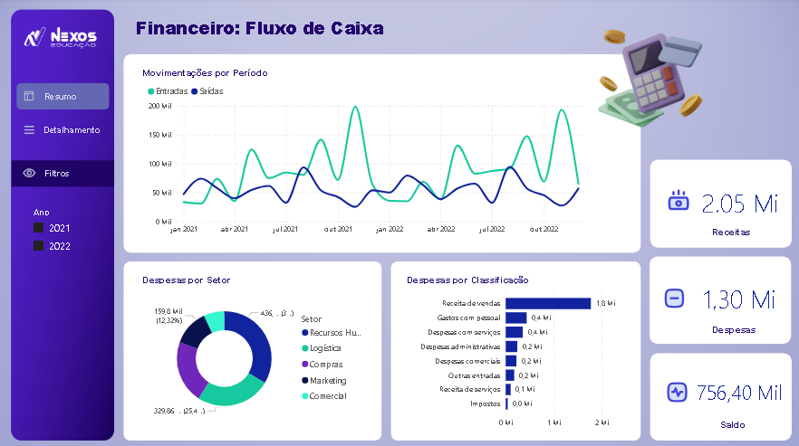
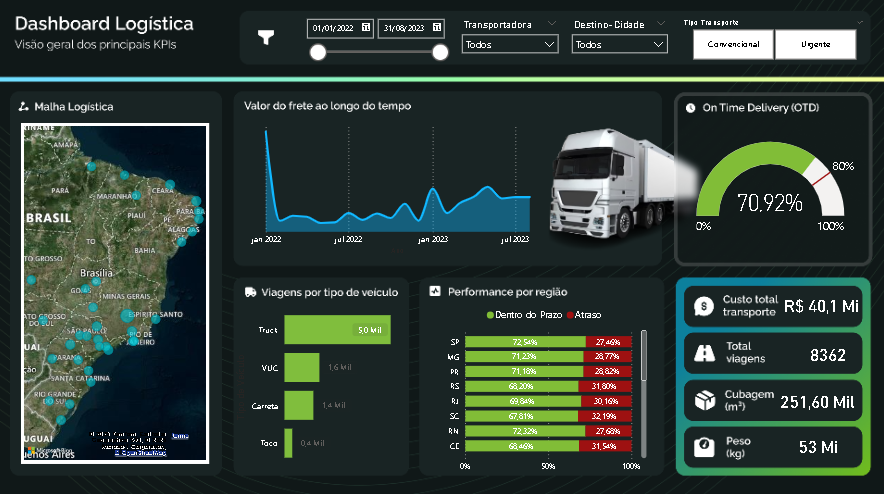
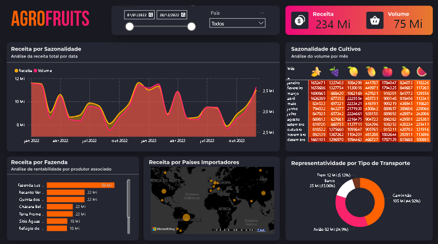

# 📊 Imersão Power BI 2025 - Business Cases

Este repositório contém os dashboards desenvolvidos durante a **Imersão Power BI 2025**, um treinamento prático voltado para transformação de dados em insights de negócios.

## 📌 Sobre o Projeto
Durante a imersão, desenvolvi **três dashboards interativos** baseados em desafios reais de empresas. Utilizei **Power BI**, **DAX** e **Power Query** para criar análises visuais que auxiliam na tomada de decisão.

### 🚀 **Objetivos**
- Aprender a modelar e transformar dados no Power BI.
- Criar métricas personalizadas utilizando **DAX**.
- Construir dashboards interativos e otimizados para análise de negócios.

---
## 📊 Dashboards Criados

### 🔹 **Business Case 1**


### 🔹 **Business Case 2**


### 🔹 **Business Case 3**


---
## 🔧 Tecnologias Utilizadas
- **Power BI** - Para visualização e modelagem de dados
- **DAX (Data Analysis Expressions)** - Para cálculos e medidas personalizadas
- **Power Query** - Para transformação e limpeza de dados

---
## 📌 Como Visualizar os Dashboards?
1. Baixe o **Power BI Desktop** ([Download aqui](https://powerbi.microsoft.com/pt-br/desktop/)).
2. Clone este repositório:
   ```bash
   git clone https://github.com/dafnirca/ImersaoPowerBI-2025.git
   ```
3. Abra os arquivos `.pbix` no Power BI.

---
## 📢 Contato
💼 Conecte-se comigo no [LinkedIn](https://www.linkedin.com/in/dafnirca) 
📂 Veja mais projetos no [GitHub](https://github.com/dafnirca)
